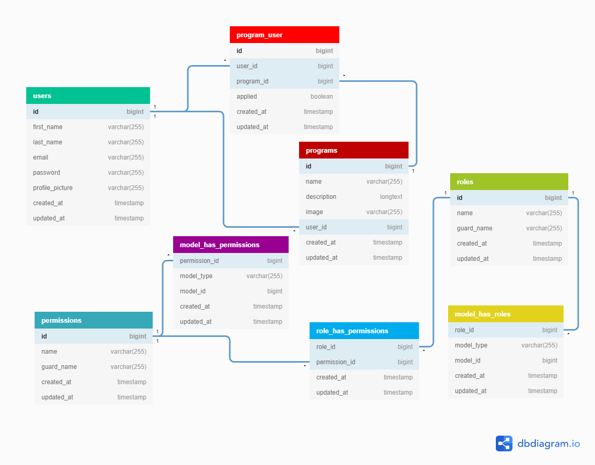

# NDS Interview Assignment
Imagine you have been assigned a project to create an Online Platform for StanbicIBTC’s Corporate Social Responsibility (CSR) program. This program is designed to help exceptional students apply for Scholarships from all 36 States in Nigeria.

However, to be able to submit a Scholarship Application, each Student must login to the Online Platform. Therefore, for Students to get Login Details to the Platform, a Program Coordinator from StanbicIBTC must first create a User Account for each of the Students.

## Assignment:
Create a small application for Creating, Reading, Updating and Deleting Students’ User Accounts.

## Requirements
1.	Create a Model, View and Controller for the basic CRUD methods for users
    - Use Bootstrap for CSS
2.	You must submit 100% code coverage using PHPUnit
3.	You must use PHP 7.x, MySQL
4.	You must follow PSR-2
5.	User records must contain at least the following:
    - Email Address
    - First Name
    - Last Name
    - Password
6.	You must submit a README file with instructions for using your application
7.	You must supply a database schema to create the tables
8.	You can assume and add anything else at your discretion

## Extra Point
1.	Ability to upload a Profile Photo
2.	Use of composer

## How to Submit your Project
1.	You must submit your project on GitHub along with commit history
2.	Only send your link to the project on GitHub

## Walkthrough
Record a short video (not more than 15 minutes) walk-through of your application, what you did, how you did it and why.

# How-to
1. Install the dependencies
   ```bash
   composer install
   ```
2. Prepare the environment variables
   ```bash
   composer run-script post-root-package-install
   ```
3. Configure your database
    ```
    DB_DATABASE=stanbicibtc_csr
    DB_USERNAME=root
    DB_PASSWORD=
    ```
4. Run this command to set-up all other necessities. **Make sure all above have been done correctly.**
   ```bash
   composer run-script post-create-project-config
   ```
5. Run your server and open the application.
   OR run `php artisan serve`

## Important Notes
1. **User roles**
  The application is authorized with roles and permissions, as there are 3 user roles (admin, program coordinator and student).
  - **Admin:** Not necessarily useful for the assignment, but very essential to most applications.
  - **Program Coordinator:** A program has a coordinator that manage the students for that program.
  - **Student:** Is registered by a program coordinator by which a password is auto-generated and sent to the student's email.
2. **Database Migrations and Seeds**
  - **Users:** An admin and a program coordinator are seeded with "nice" emails and password="password". "Nice emails" mean the app's url host (`APP_URL` in the `.env` file). For example, if `APP_URL=http://stanbicibtc-csr.test`, then, the emails generated for the users will be "*admin@stanbicibtc-csr.test*" and "*programcoordinator@stanbicibtc-csr.test*" respectively.
  - **Programs:** The "scholarship program" is seeded. And the "programcoordinator@stanbicibtc-csr.test" is assigned as the coordinator.
3. Mails
  - Configure your mail server in the `.env` file
    ```
    MAIL_HOST=mailhog
    MAIL_PORT=1025
    MAIL_USERNAME=null
    MAIL_PASSWORD=null
    MAIL_ENCRYPTION=null
    MAIL_FROM_ADDRESS=null
    ```
  - All mails are queued automatically for better performance. Hence, you need to open the queue worker.
    ```bash
    php artisan queue:work

    OR

    php artisan queue:listen
    ```

# References

[Diagram Schema](https://dbdiagram.io/d/603034dbfcdcb6230b20a96d)
[Tutorial Guide](https://drive.google.com/file/d/1uJdAeo7Dzqy6vD5u42_sqEeh8iIrjcJt/view?usp=sharing)
